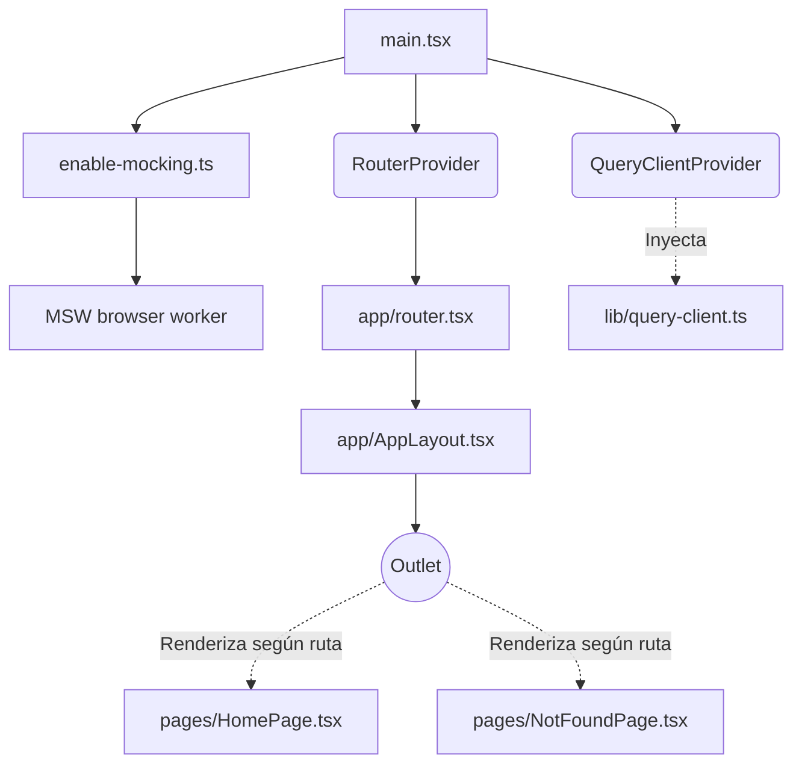

# Web Scanner - Frontend

Este es el repositorio del frontend para el proyecto Web Scanner, construido con herramientas modernas para garantizar rendimiento, escalabilidad y una excelente experiencia de desarrollo.

##  Tecnologías Usadas

El proyecto utiliza el siguiente stack tecnológico:

- **[React](https://react.dev/)**: Biblioteca principal para construir la interfaz de usuario.
- **[Vite](https://vite.dev/)**: Herramienta de construcción (build tool) y servidor de desarrollo ultrarrápido.
- **[TypeScript](https://www.typescriptlang.org/)**: Tipado estático para JavaScript, previniendo errores y mejorando la experiencia del desarrollador.
- **[React Router](https://reactrouter.com/)**: Enrutamiento de la aplicación (Single Page Application).
- **[Tailwind CSS](https://tailwindcss.com/) v4**: Framework de CSS basado en utilidades para un diseño ágil.
- **[React Query](https://tanstack.com/query/latest)**: Gestión de estado del servidor, caché y sincronización de datos.
- **[MSW](https://mswjs.io/)**: Interceptación de solicitudes HTTP para ejecutar el frontend con mocks durante el desarrollo y las pruebas.
- **[tsx](https://tsx.is/)**: Ejecución del smoke test escrito en TypeScript.
- **openapi-typescript**: Generación de tipos TypeScript a partir del contrato OpenAPI.
- **Oxlint**: Linter ultrarrápido para mantener la calidad del código.
- **Docker & Nginx**: Contenedorización y servidor web ligero para el despliegue a producción.

##  Arquitectura del Frontend

La aplicación sigue una arquitectura modular y escalable. A continuación un diagrama simplificado del flujo principal:



### Estructura de Carpetas

- `docker/`: Archivos de configuración para el despliegue (Dockerfile, nginx.conf, etc).
- `src/app/`: Configuración global de la aplicación (Enrutador, Layouts principales).
- `src/pages/`: Vistas de nivel superior asociadas a una ruta (e.g., HomePage).
- `src/components/ui/`: Componentes reutilizables e independientes de la interfaz (preparado para shadcn/ui).
- `src/features/`: Módulos o dominios específicos de la aplicación.
- `src/lib/`: Utilidades, clientes globales (ej. cliente de React Query) y configuración de entorno (`env.ts`).
- `src/mocks/`: Handlers y fixtures de MSW, worker del navegador y smoke test de los endpoints simulados.
- `public/mockServiceWorker.js`: Service worker generado por MSW para interceptar solicitudes en el navegador.

## Mocks y comportamiento local

En desarrollo, `main.tsx` ejecuta `enableMocking()` antes de montar React. Por defecto, MSW intercepta las solicitudes de análisis cuando `import.meta.env.DEV` es verdadero. Para desactivar los mocks y usar el backend configurado en Vite, define:

```env
VITE_USE_MOCKS=false
```

El mock cubre la creación de análisis, la consulta por identificador, el listado, el bloqueo de URLs locales o privadas y el conflicto cuando ya existe un análisis pendiente o en ejecución. Al abrir el frontend en `/`, la pantalla inicial muestra `Bienvenido a la página principal`.

## 🧪 Pruebas y Comprobaciones (Para Testers)

Si necesitas verificar que el entorno y el proyecto están funcionando correctamente, ejecuta los siguientes comandos desde la raíz del repositorio. Los comandos usan `npm --prefix frontend` porque el `package.json` del frontend está dentro de esa carpeta.

### 0. Instalación de dependencias

```powershell
npm --prefix frontend install
```

Si npm reporta un conflicto de peer dependencies entre `openapi-typescript` y TypeScript 6, usa:

```powershell
npm --prefix frontend install --legacy-peer-deps
```

### 1. Smoke test de los mocks

```powershell
npm --prefix frontend run verify:mocks
```
> **Resultado esperado:** Debe mostrar `Mock handlers smoke test passed`. Este test verifica listado vacío inicial, creación con respuesta `201`, conflicto `409`, consulta de detalle `200` y análisis inexistente `404`.

### 2. Verificación de Código (Linting)
```powershell
npm --prefix frontend run lint
```
> **Resultado esperado:** Debe mostrar `Found 0 warnings and 0 errors`.

### 3. Compilación para Producción (Build)
```powershell
npm --prefix frontend run build
```
> **Resultado esperado:** Compila usando `tsc -b` y `vite build` y debe terminar exitosamente sin arrojar errores de TypeScript ni de empaquetado.

### 4. Servidor de Desarrollo Local
```powershell
npm --prefix frontend run dev
```
> **Resultado esperado:** Inicia el servidor de desarrollo en `http://localhost:5173/`. Al abrir esta URL en el navegador, debes ver la página inicial que dice "Web Scanner" o "Bienvenido a la página principal".

### 5. Construcción de Imagen Docker
Desde `frontend`:

```powershell
cd frontend
docker build -f docker/Dockerfile -t web-scanner-frontend .
```
> **Resultado esperado:** Construye la imagen de Docker utilizando las dos etapas (Node.js y Nginx). Debe finalizar exitosamente.

### 6. Ejecución del Contenedor Docker
Continúa dentro de `frontend`:

```powershell
docker run --rm -p 127.0.0.1:8081:8080 web-scanner-frontend
```
> **Resultado esperado:** Levanta el contenedor exponiendo el puerto 8081 en tu máquina local. Si abres `http://127.0.0.1:8081/` en el navegador, deberías ver la aplicación servida por Nginx. (Usa `Ctrl+C` en la terminal para detener y eliminar el contenedor temporal).